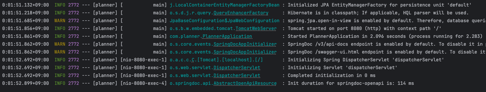
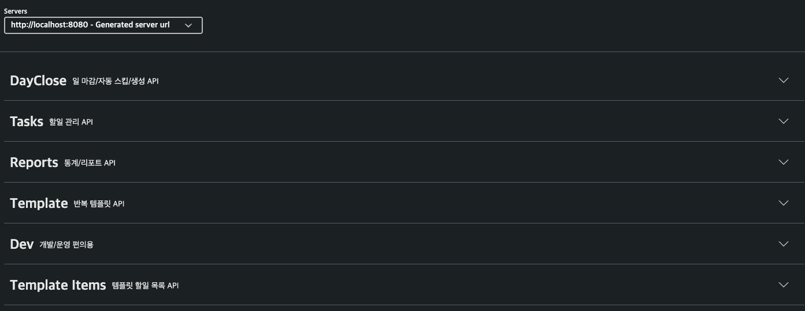
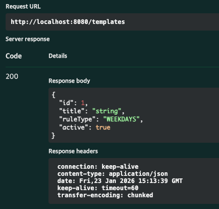
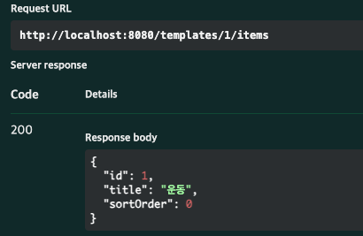
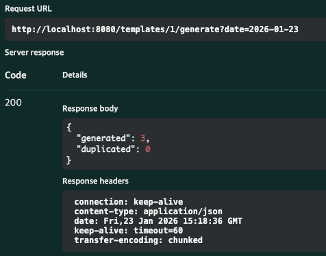
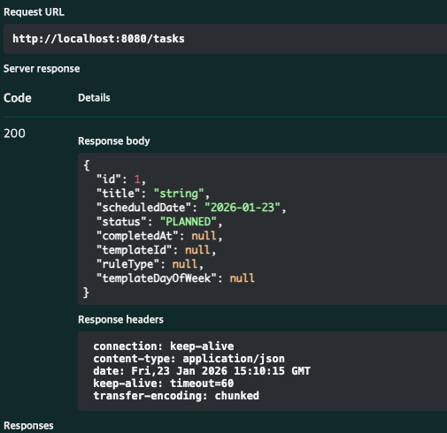
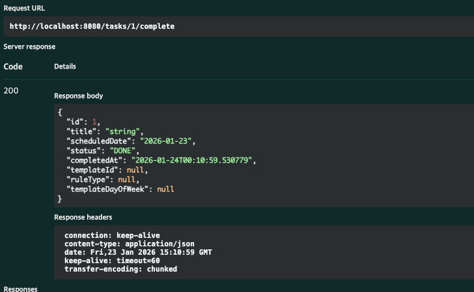

# Planner (Study Planner Backend)

[](https://github.com/<OWNER>/<REPO>/actions/workflows/ci.yml)


할 일(Task) + 반복 템플릿(Template) 기반으로 일정을 관리하고,
Day Close(자정 마감)로 미완료 처리/이월, 그리고 통계를 제공하는 백엔드 API 서버입니다.

- UI 없이 **Swagger(OpenAPI)** 로만 테스트/검증

---

## Tech Stack
- Java(21) / Spring Boot(3.5.x)
- Spring Web, Spring Data JPA
- Validation (jakarta.validation)
- MySQL
- Springdoc OpenAPI (Swagger UI)
- Gradle

---

## Local Setup

### 1) DB 준비 (MySQL)
- DB 생성 후 아래 설정을 `application-local.yml` 또는 환경변수로 지정

예시)
- `spring.datasource.url=jdbc:mysql://localhost:3306/planner`
- `spring.datasource.username=...`
- `spring.datasource.password=...`

### 2) 실행
```bash
./gradlew bootRun
또는
PlannerApplication 실행
```

---
## Swagger
- Swagger UI: `/swagger-ui/index.html`

(프로젝트 설정에 따라 경로가 다를 수 있으며, 실제 노출 경로 기준.)
  

---

## Core Features

### 1) Task CRUD + 상태 관리
- Task 생성/조회/수정/삭제 API 제공
- 상태: **PLANNED / DONE / SKIPPED**
- `undo`로 **DONE/SKIPPED → PLANNED 복귀**
- `GET /tasks/{id}/events`로 상태 변경/사유 등 **이력(Event) 조회**

### 2) 멱등성(Idempotency) 처리
- `POST /tasks/{id}/complete`는 `Idempotency-Key` 헤더 기반으로 **중복 요청 방지**
- 네트워크 재시도/중복 클릭 상황에서도 **1회만 처리되도록 보장**

### 3) Template 기반 반복 생성 (Template + Items)
- 반복 규칙을 가진 **Template** 생성 (예: WEEKDAYS/WEEKENDS 등)
- Template에 **여러 Item(할 일 목록)** 등록
- `POST /templates/{id}/generate?date=YYYY-MM-DD`
    - 지정 날짜에 Item 개수만큼 **Task 일괄 생성**
    - 동일 날짜/동일 Item의 중복 생성은 방지(생성 결과 집계 반환)

### 4) Day Close(자정 마감) 처리
- 특정 날짜를 마감하면서 **미완료 Task 자동 SKIP**
- 반복 템플릿 기반 Task는 규칙에 따라 **다음 날짜 Task 생성/이월**
- 중복 실행 방지를 위한 Guard 로직 포함(동일 날짜 마감 1회 보장)

### 5) Reports (통계)
- `/reports/daily` : 일별 집계
- `/reports/summary` : 기간 요약 통계
- `/reports/templates` : 템플릿/단발성(ONE_OFF) 기준 집계
---

## Template Flow
<details>
<summary> 🔽 Template Flow (create -> items -> generate)</summary>







1) Template 생성
- `POST /templates` (예: WEEKDAYS / WEEKENDS 템플릿)

2) Template Items 등록(할 일 목록 구성)
- `POST /templates/{id}/items` 를 여러 번 호출해 아이템 추가
    - 예: 공부(1), 운동(2), 독서(3)

3) 특정 날짜에 Task 생성
- `POST /templates/{id}/generate?date=YYYY-MM-DD`
    - 해당 날짜에 아이템 수만큼 Task가 생성됨
    - 동일 날짜에 재호출하면 중복 생성은 방지되고 결과가 집계되어 반환됨

</details>

---

## API Endpoints
<details>
<summary>🔽 API Endpoints </summary>

### Tasks
- `POST /tasks` : 할 일 생성
- `GET /tasks?date=YYYY-MM-DD&from=&to=&status=` : 날짜/기간/상태 검색 
  - `date`: 기본 필터(필요 시)
  - `from/to/status`: 선택
- `GET /tasks/{id}` : 단건 조회
- `PATCH /tasks/{id}` : 수정
- `DELETE /tasks/{id}`: 삭제
- `POST /tasks/{id}/complete` : 완료 처리
  - Header: `Idempotency-Key`: <string>
- `POST /tasks/{id}/undo` : 완료/스킵 취소(PLANNED로 복귀)
  - Body(optional): `{ "reason": "..." }`
- `POST /tasks/{id}/skip` : 스킵 처리 
  - ex)Body(optional): `{ "reason": "..." }`
- `GET /tasks/{id}/events` : 이벤트(이력) 조회

### Templates
- `POST /templates` : 템플릿 생성
- `POST /templates/{id}/generate?date=YYYY-MM-DD` : 해당 날짜에 템플릿 기반 Task 생성

### Template Items
- `GET /templates/{id}/items` : 템플릿 아이템 목록 조회
- `POST /templates/{id}/items` : 템플릿 아이템 추가
  - Body: `{ "title": "...", "sortOrder": 0 }`

### Day Close
- `POST /day-close?date=YYYY-MM-DD&carryOver=true&carryTo=YYYY-MM-DD`
    - `carryOver` 기본값: `true`
    - `carryTo` : 선택(직접 이월할 날짜 지정)

### Reports
- `GET /reports/daily?from=YYYY-MM-DD&to=YYYY-MM-DD`
- `GET /reports/summary?from=YYYY-MM-DD&to=YYYY-MM-DD`
- `GET /reports/templates?from=YYYY-MM-DD&to=YYYY-MM-DD`

### Dev
- `POST /admin/jobs/day-close/run?date=YYYY-MM-DD` : 특정 날짜 Day Close 강제 실행
- `POST /admin/jobs/day-close/run-yesterday` : 어제 날짜 Day Close 강제 실행

</details>

